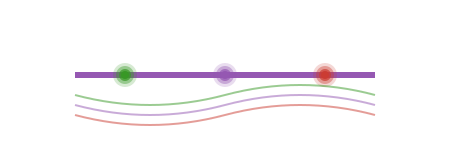

# PositionalEmbeddings.jl

[](https://mashu.github.io/PositionalEmbeddings.jl/stable/)
[](https://mashu.github.io/PositionalEmbeddings.jl/dev/)
[](https://github.com/mashu/PositionalEmbeddings.jl/actions/workflows/CI.yml?query=branch%3Amain)
[](https://codecov.io/gh/mashu/PositionalEmbeddings.jl)

A Julia package providing various positional embedding implementations for enriching sequence data with position information.

## Features

- **Absolute Positional Embeddings (AbsolutePE)**: Implementation of the sinusoidal position embeddings from [Attention Is All You Need](https://arxiv.org/abs/1706.03762)
- **Rotary Position Embeddings (RoPE)**: Implementation of the rotary position embeddings from [RoFormer: Enhanced Transformer with Rotary Position Embedding](https://arxiv.org/abs/2104.09864)

## Installation

```julia
using Pkg
Pkg.add("PositionalEmbeddings")
```

## Quick Start

Different positional embeddings expect different input tensor layouts:

- **AbsolutePE** works with inputs of shape `(seq_len, channels, batch)`, adding position-specific values uniformly across channels and batches for each sequence position.

- **RoPE** operates on inputs of shape `(head_dim, seq_len, nhead*batch)`, applying rotations between pairs of dimensions in `head_dim` independently for each sequence position, across heads and batches.

Example:
```julia
using PositionalEmbeddings
# Absolute Positional Embeddings
pe = AbsolutePE(512, 1024)  # embedding_size=512, max_length=1024
x = randn(Float32, 100, 512, 32)  # (seq_len, channels, batch)
x_with_pos = pe(x)

# Rotary Position Embeddings
rope = RoPE(512, 1024)  # head_dim=512, max_length=1024
x = randn(Float32, 512, 100, 2*32)  # (head_dim, seq_len, (nhead*batch_size))
x_with_pos = rope(x)
```
⚠️ For **RoPE** users must ensure that all precomputed matrices are not treated as trainable parameters.
For example with `Optimisers.trainable(::RoPE) = (;)`

## Contributing

Contributions are welcome! Please feel free to submit a Pull Request.

## License

This project is licensed under the MIT License - see the LICENSE file for details.

